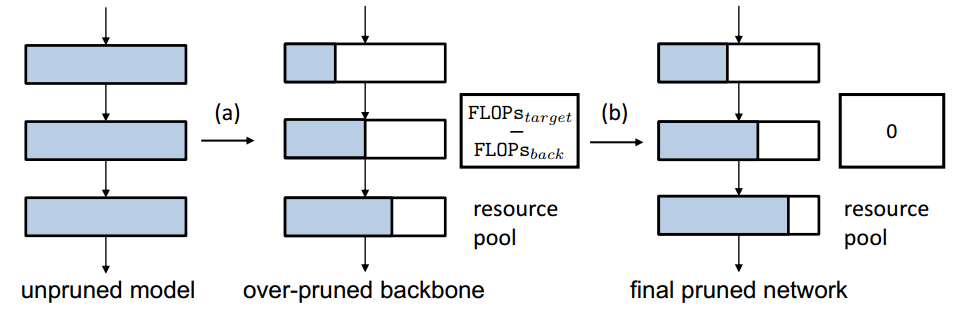

## Network Pruning via Resource Reallocation (To be accepted by PR 2023)

The source code of **Network Pruning via Resource Reallocation**


## News
- **2023-05** Codes are on cleaning.


## Installation

### Requirements
- PyTorch

## Data Preparation

### ImageNet

## Train


## Citation

If you use the codes, please cite the following publication:
```
@inproceedings{peel,
    title     = {Network Pruning via Resource Reallocation},
    author    = {Hou, Yuenan and Ma, Zheng and Liu, Chunxiao and Wang, Zhe and Loy, Chen Change},
    booktitle = {Pattern Recognition},
    year      = {2023}
}
```

## Acknowledgements
We thanks for the opensource codebases, i.e., [pytorch/examples](https://github.com/pytorch/examples) and [network-slimming](https://github.com/Eric-mingjie/network-slimming).
